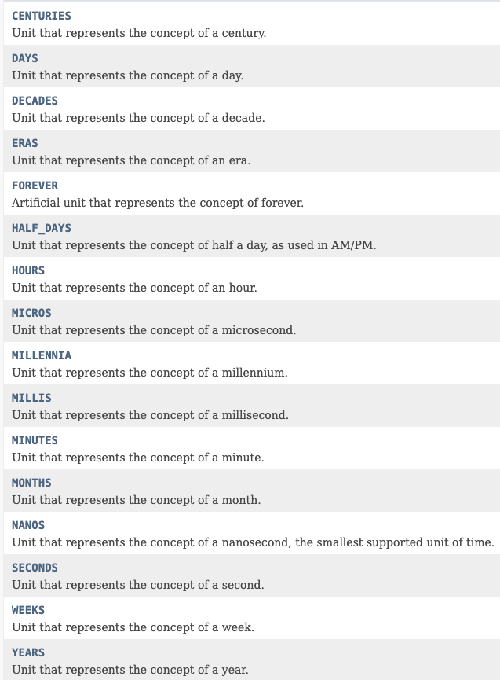

# Optional

새로운 인터페이스

Java 8 이전에는 두가지 문제가 있다.

```java
if(A!=null) //이런 NPE오류 잡는 경우에는 휴먼 오류가 발생할 이유가 많다.
```

→ null 을 리턴을 줄수밖에 없는 상황이 생기는 것도 문제다.  로직처리를 위해서 Exception처리를 하는게 결국 자원을 소모하는 행동.

이러한 위의 문제들을 명시적으로 해결하기 위해서 필요한 기술

Optional의 경우 .of를 사용하면, ⇒ null이 들어올 수도 있다.

Optional의 경우 .ofNullable ⇒ null이 들어올수 있는 상황을 만들지 않는다.

### 주의 사항

- Return 타입에 사용하기를 권장

  ```java
  public void setA(Optional<Progress> pr){
  	pr.ifPresent(p-> this.progress = p) //이것조차도 위험하다...
  }
  ```

  setA(null)울 통해서 값이 들어가면 또 널이 들어가고... NPE가 또 발생하고...

  인스턴스 타입도 쓰지 말기 **이건 아예 설계 문제임**

- 원시타입은 Optional이 제공되므로 기본 Optional을 통해서 쓰지말고 OptionalInt, OptionalLong과 같은걸 쓰면 좋다. ⇒ Autoboxing에서 큰 오류를 발생시킬 수 있으므로...

- Null 타입 리턴하지 말고 Empty()로 리턴해버림.

- Collections, maps,arrays,Stream은 굳이 Optional로 감쌀이유가 없다.  → 이미 비어있는지 체크가 되는데 굳이 할필요가 있느냐는 것?

# Optional API

Optional에서 get을 통해서 그 인스턴스를 가져올수있는데... 만약 그 값이 없는경우에는...? ⇒  기본 형식 `NoSuchElementException()`을 통해 발생.

있는지 확인해보고 꺼내는 게 중요함.

get()외에 다른 걸 사용하는게 좋다.

Optional에 값이 있는 경우에 그 값을 가지고 ~~를 하라.

- ifPresent(Consumer) ⇒ 람다식을 통해서 사용하기...
- 예) Spring으로 시작하는 수업이 있으면 id를 출력하라.

Optional에 값이 있으면 가져오고 없는 경우에 ~~를 리턴하라.

- orElse(T) ⇒ 인스턴스 타입으로 꼭 받아야하는 경우...
- 예) JPA로 시작하는 수업이 없다면 비어있는 수업을 리턴하라.

Optional에 값이 있으면 가져오고 없는 경우에 ~~를 하라.

- orElseGet(Supplier)
- 예) JPA로 시작하는 수업이 없다면 새로 만들어서 리턴하라.

Optional에 값이 있으면 가졍고 없는 경우 에러를 던져라.

- orElseThrow() ⇒ 기본은 NoSuchElementException을 발생시킴.

리턴타입이 Optional인 경우!

Optional에 들어있는 값 걸러내기

- Optional filter(Predicate)

Optional에 들어있는 값 변환하기

- Optional map(Function)
- Optional flatMap(Function): Optional 안에 들어있는 인스턴스가 Optional인 경우에 사용하면 편리하다. ⇒ 이중으로 되어잇는 경우에는 Stream에서 사용하는 경우와 비슷하게 ... 분리해서 쪼개주는 걸 뜻한다.

# Date와 Time

자바 8에서는 새로운 날짜와 시간 API가 생긴 이유는

- 그전까지 사용하던, 

  Java.util.Date

   클래스가 mutable하기도 하며, 클래스이름 자체가 이상함. Date인데, 시간까지 포함하고 있다.

  - 값이 자꾸 바뀜;; thread 두개에서 1초간격으로 차이가 날수도 있음.
  - Calendar는 1월이 0부터 시작해놔서... 10월 5일을 ⇒ 9월 5일로 구현해야함.

- 버그가 발생할 여지가 많음. 날짜 처리가 복잡한 애플리케이션에서는 Joda time을 쓰기도 했음.

그래서 JSR-310의 표준을 통해서 구현함. 아래와 같은 개발 정의를 통해서 개발되어짐.

- Clear

- Fluent

  null없으므로 메소드 체인 사용 가능

- Immutable

  기존 인스턴스는 냅두고, 새로운 같은 값을가지는 인스턴스를 만들어서 추가하는 식으로 구성됨.

- Extensible

  확장성 → 불교력과 같은 여러가지 특이 케이스들에 대해서도 쉽게 가져감

## 특징

기계용 시간과 사람용 시간을 분리해둠.

Instant → 기게

LocalDate, LocalTime, LocalDateTime → 사람.

시간 기반 ⇒ Duration 날짜 기반 ⇒ Period

DatetimeFormatter를 사용해 특정 문자열로 포메팅 가능

# Date/Time API

Instant.now() →현재 UTC 기준시를 통해서 출력 (GMT)

ZoneId를 통해서 시간 존을 붙혀준다.

ZoneId.of("asia/seoul")을 통해서 시간 존을 직접 지정도 가능하다.

LocalDateTIme ⇒ 현재 시스템 타임 존에 해당하는  일시를 리턴함.

직접 구현하면 of , now() 메소드를 통해서 현 시간을 출력할 수도 있다.

ZonedDateTime.of()→ 특정 타임존의 시간을 만들어서 출력가능.

### 기간 표현

Period(사람용) / Duration(기계용) . between() → 혹은 util과 같은 기간 시간 차이를 나타낼 수도 있다.

### 특정 시간형식으로 출력하고 싶은경우?

DateTimeFormatter에 직접 지정할 수도 있으며 `DateTimeFormatter.ofPattern()`

Formatter에 사용되는 형식은 다음처럼 사용 가능.

```
  Symbol  Meaning                     Presentation      Examples
  ------  -------                     ------------      -------
   G       era                         text              AD; Anno Domini; A
   u       year                        year              2004; 04
   y       year-of-era                 year              2004; 04
   D       day-of-year                 number            189
   M/L     month-of-year               number/text       7; 07; Jul; July; J
   d       day-of-month                number            10

   Q/q     quarter-of-year             number/text       3; 03; Q3; 3rd quarter
   Y       week-based-year             year              1996; 96
   w       week-of-week-based-year     number            27
   W       week-of-month               number            4
   E       day-of-week                 text              Tue; Tuesday; T
   e/c     localized day-of-week       number/text       2; 02; Tue; Tuesday; T
   F       week-of-month               number            3

   a       am-pm-of-day                text              PM
   h       clock-hour-of-am-pm (1-12)  number            12
   K       hour-of-am-pm (0-11)        number            0
   k       clock-hour-of-am-pm (1-24)  number            0

   H       hour-of-day (0-23)          number            0
   m       minute-of-hour              number            30
   s       second-of-minute            number            55
   S       fraction-of-second          fraction          978
   A       milli-of-day                number            1234
   n       nano-of-second              number            987654321
   N       nano-of-day                 number            1234000000

   V       time-zone ID                zone-id           America/Los_Angeles; Z; -08:30
   z       time-zone name              zone-name         Pacific Standard Time; PST
   O       localized zone-offset       offset-O          GMT+8; GMT+08:00; UTC-08:00;
   X       zone-offset 'Z' for zero    offset-X          Z; -08; -0830; -08:30; -083015; -08:30:15;
   x       zone-offset                 offset-x          +0000; -08; -0830; -08:30; -083015; -08:30:15;
   Z       zone-offset                 offset-Z          +0000; -0800; -08:00;

   p       pad next                    pad modifier      1

   '       escape for text             delimiter
   ''      single quote                literal           '
   [       optional section start
   ]       optional section end
   #       reserved for future use
   {       reserved for future use
   }       reserved for future use
```

미리 지정되어있는 포메터를 통해서 직접 사용할 수 도 있음 → LocalDate.ISO type과 같은..

### 래거시 API도 지원한다.

Date → Instant 혹은 Instant → Date로 변환할 수 있음.

구 레거시를 Instant로 변환해서 → 현 Java8 강의로 변환?

반대도 가능. 현 자바 8의 형태를 → 구 래거시 코드로 구현 가능함.

## 시간 비교시 유용한 방식

위의 방식은 대부분 시간 메소드를 어떤식으로 사용해야하는 지에 대해서 이야기하는게 대부분인데, 실제로 제일 필요한 건 시간 비교가 제일 유용할 것 같아서 좀 더 정리해본다.

```java
LocalDateTime time1 = LocalDateTime.of(2021, 11, 3, 10, 18, 0);
LocalDateTime time2 = LocalDateTime.of(2021, 11, 3, 10, 19, 0);

public boolean isAfter(ChronoLocalDate other)  //주어진날짜가 other보다 크면.. True

System.out.println(time1.isAfter(time2)); //false
System.out.println(time2.isAfter(time1)); //true

public boolean isBefore(ChronoLocalDate other) //주어진날짜가 other보다 작으면.. True

System.out.println(time1.isBefore(time2)); //true
System.out.println(time2.isBefore(time1)); //false

public boolean isEqual(ChronoLocalDate other) //주어진날짜가 other보다 같으면.. True

public int compareTo(ChronoLocalDate other)  //주어진날짜가 other보다 같으면 0, 크면 + 작으면 -
System.out.println(time1.compareTo(time2)); //-1
System.out.println(time2.compareTo(time1)); // 1
//날짜를 하루정도로 바꿔서 변환해보자 11/3 11/4 시간은 동일하게
System.out.println(time1.compareTo(time2)); //-1
System.out.println(time2.compareTo(time1)); // 1

public LocalDateTime truncatedTo(TemporalUnit unit)  
```

`truncatedTo` 를 예상보다 잘 사용중 → 직관적임

파라미터로 지정된 단위 이후의 값들을 버린 후, 복사한 LocalDateTime 객체를 리턴합니다.

이때, 파라미터로 전달되는 단위는 ChronoUnit 클래스에 지정된 상수를 사용하며,

DAYS보다 큰 단위인 YEARS, MONTHS 등의 값은 허용되지 않습니다.

```java
LocalDateTime time1 = LocalDateTime.of(2021, 11, 3, 10, 18, 3);
System.out.println(time1.truncatedTo(ChronoUnit.SECONDS)); //2021-11-03T10:18:03
System.out.println(time1.truncatedTo(ChronoUnit.MINUTES)); //2021-11-03T10:18
System.out.println(time1.truncatedTo(ChronoUnit.HOURS)); //2021-11-03T10:00
System.out.println(time1.truncatedTo(ChronoUnit.DAYS)); //2021-11-03T00:00
```

현 기준 날짜로 절사 해서 사용가능.

그리고 현 시간을 시점으로 + -도 ChronoUnit으로 더 효율적으로 할 수 있다.

```java
LocalDateTime time1 = LocalDateTime.of(2021, 11, 3, 10, 18, 3);
LocalDateTime time2 = LocalDateTime.of(2021, 11, 4, 10, 18, 0);
//3일이 더해짐.
System.out.println(time1.plus(3, ChronoUnit.DAYS)); //2021-11-06T10:18:03
//3일이 빠짐.
System.out.println(time1.minus(3, ChronoUnit.DAYS)); //2021-11-06T10:18:03
//구체적으로 3년이 이런식으로 추가도 가능하다.
System.out.println(time1.plusYears(3));//2024-11-03T10:18:03
//빼는것도 ㅆㄱㄴ
System.out.println(time1.minusYears(3)); //2018-11-03T10:18:03

//아니면 이런식으로 사용할수도 있다.
ChronoUnit.HOURS.between(time1, time2); //23시간정도의 차이
```

ChronoUnit은 Enum Type으로 여러가지 시간 단위를 가지고 있다.



출처:

[[Java\] 날짜 비교하기 ( LocalDate, LocalDateTime, Date, Calendar)](https://hianna.tistory.com/611)

[[Java8 Time API\] Duration과 Period 사용법 (+ChronoUnit)](https://www.daleseo.com/java8-duration-period/)